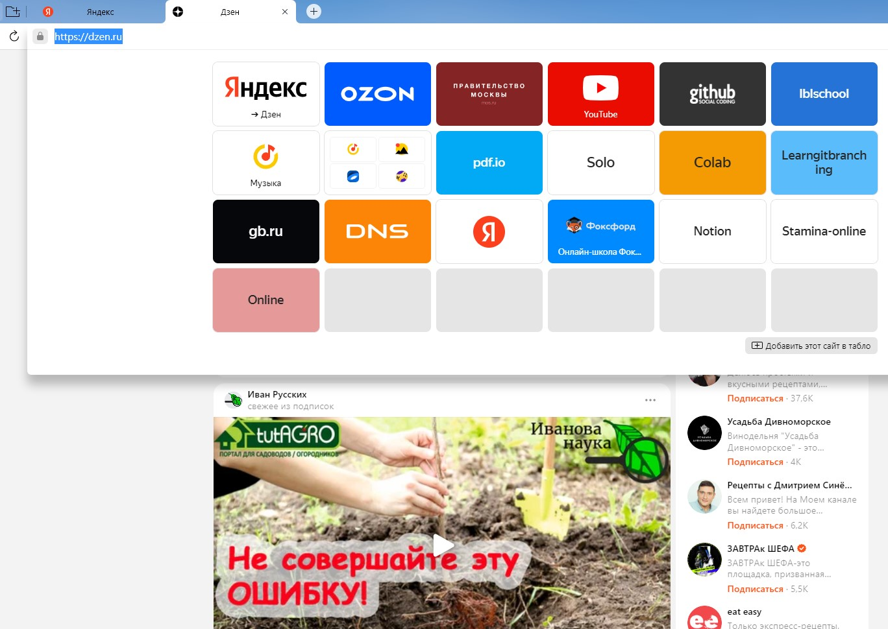
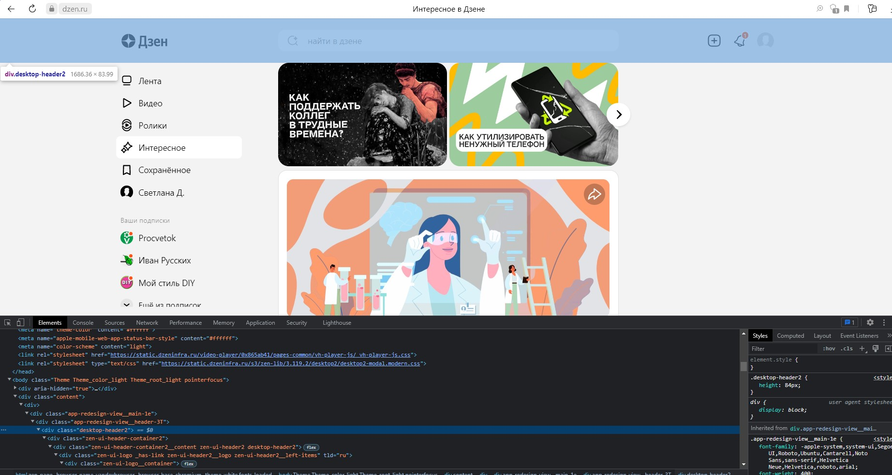
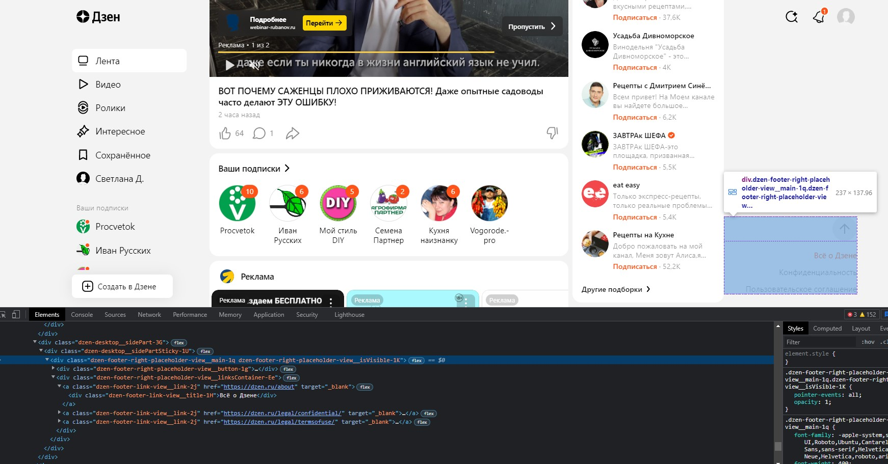
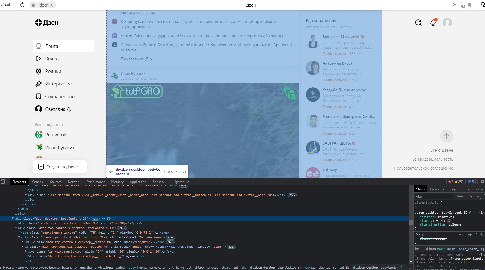
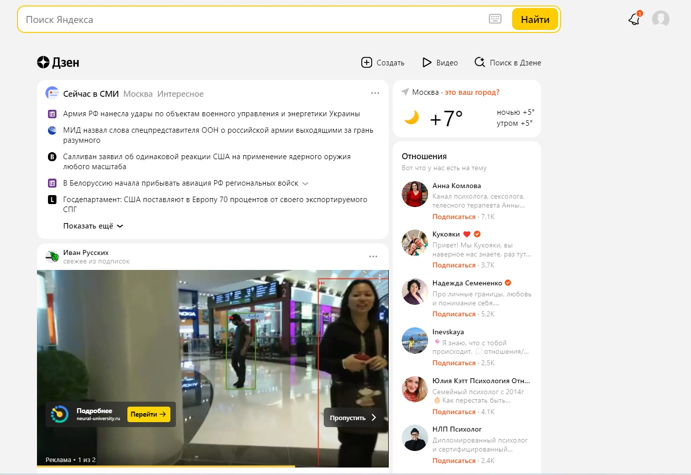
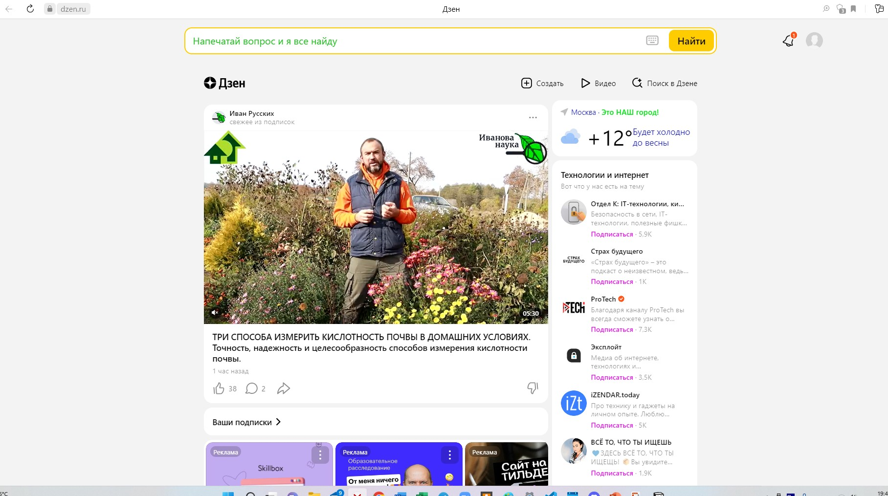
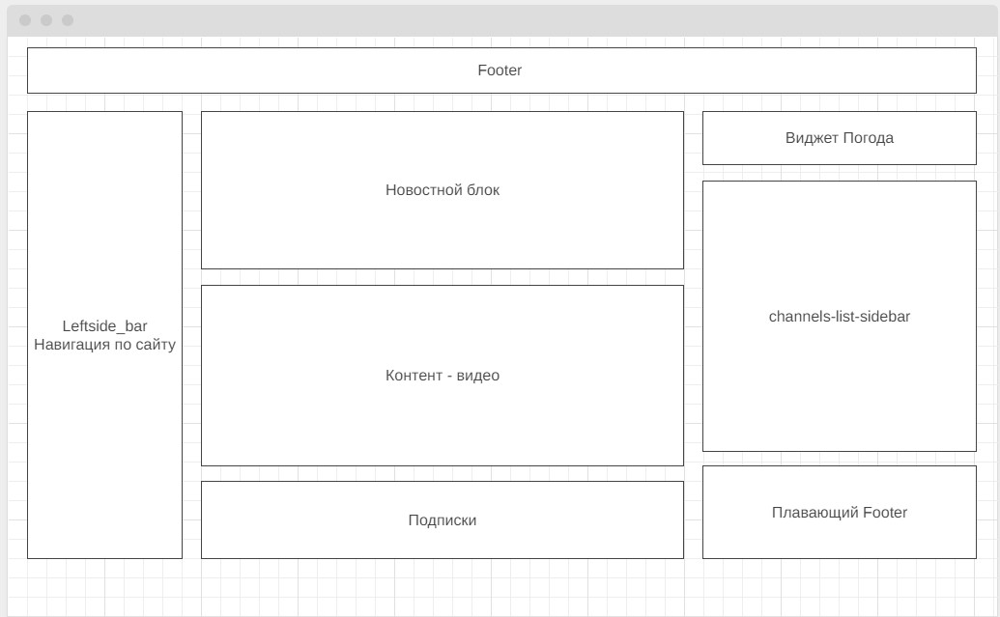

>1. https://dzen.ru/  работает на безопасном протоколе

>2.  **Шапка (header) сайта есть.**

В header расположены: Логотип Дзен, поисковая строка, колокольчик, плюсик и кнопка личного кабинета.

> **Подвал (footer) сайта есть.**

В footer расположены: стрелочка вверх, Все о Дзене, Конфиденциальность и Пользовательское соглашение.

> Контент расположен между футером и хедером.

> **На сайте есть:**
- видео-контент - основной на этом сайте;
- слева:
    -  блок с подписками;
    - навигатор по видео-контенту;
- над основным контентом блок с ссылками на новости:
- карусель с рекламой;
Справа:
    - карусель с каналами.
    - виджет с погодой

3. **Страница до изменений**

    **Страница после изменений:**

4. **Прототип низкой детализации**
